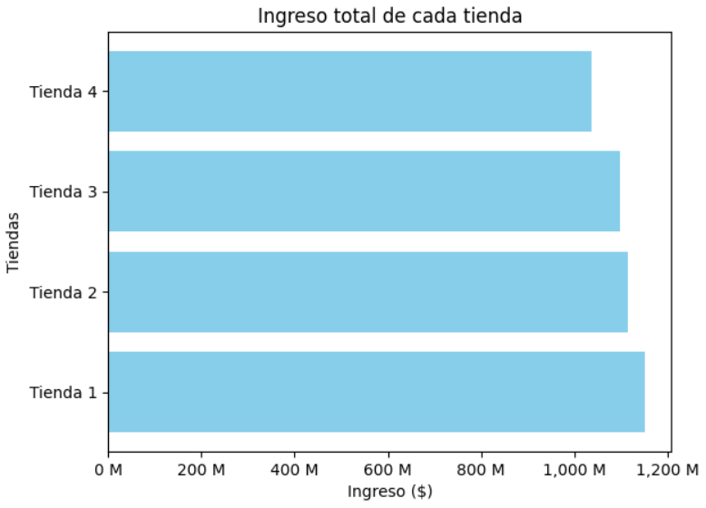
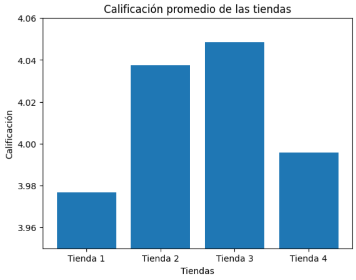
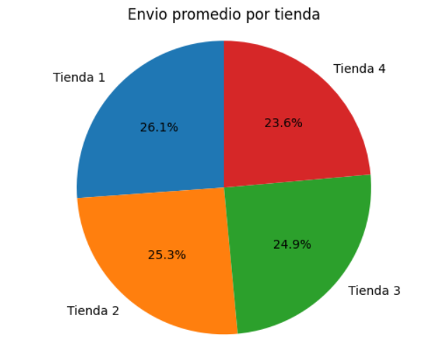

# Store Analysis for Sale Decision

This project performs a data analysis to help an entrepreneur, Mr. Juan, make an informed decision on which of his four stores to sell in order to finance a new business.

📝 Description
The analysis focuses on various performance metrics extracted from the sales data of four stores. Using Python, along with the Pandas library for data manipulation and Matplotlib for visualization, each store is evaluated to determine the most suitable candidate for sale.

The goal is not only to identify the store with the highest value, but the one that, when sold, represents the best strategic decision for the overall health of the business and the owner's future investment plans.

🎯 Objective
The main objective is to analyze the data of four stores owned by Mr. Juan to identify the most suitable one for sale, in order to finance a new venture.

🛠️ Tools Used
Python: Main programming language.

Pandas: For data loading, cleaning, manipulation, and analysis.

Matplotlib: For creating visualizations and charts that facilitate the interpretation of the results.

📊 Analysis Performed
To arrive at a recommendation, the analysis was based on the following key points, using the provided data:

Total Revenue: The total revenue generated by each store was calculated to understand its financial performance.

Performance by Category: Product categories (Furniture, Electronics, etc.) were analyzed to see which are the most popular in each store, helping to identify their strengths and weaknesses.

Average Rating: Product ratings were averaged by store to measure customer satisfaction, a key indicator of the business's health and reputation.

Best and Least Sold Products: Specific products with the highest and lowest turnover were identified to understand inventory behavior.

Operating Costs: The average shipping cost per store was evaluated to gain insight into logistics efficiency and associated expenses.

💡 Conclusion and Recommendation
After analyzing the metrics, it is concluded that each store has a distinct performance profile. The final recommendation is based on a combination of factors such as revenue, customer satisfaction, and costs.

Based on the analysis, the sale of Store 4 is recommended. This decision is supported by the fact that it presents the lowest revenue and one of the poorest average ratings. Selling it would allow Mr. Juan to obtain capital for his new business with minimal impact on the main revenue stream, while divesting from the asset with the lowest current performance and the greatest areas for improvement.
